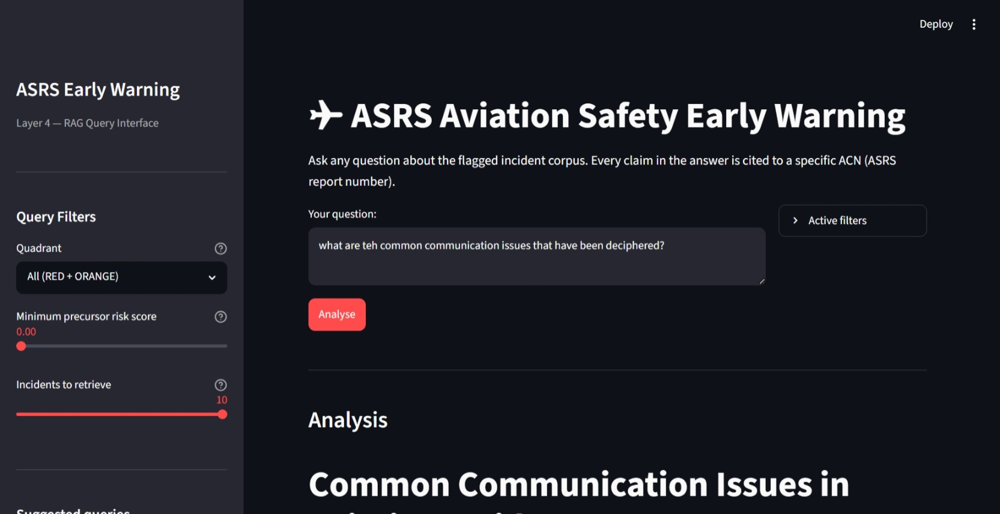
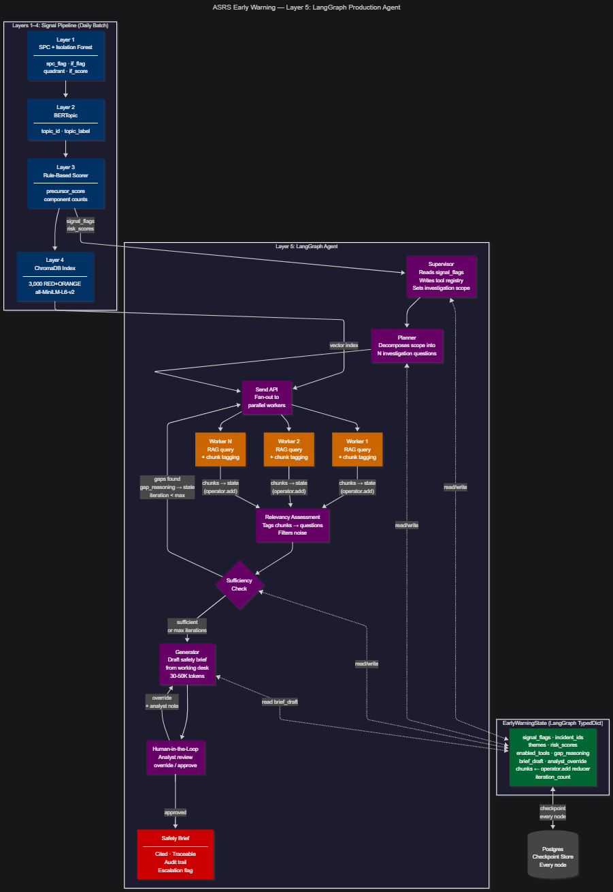

# ASRS Aviation Safety Early Warning System

<!-- markdownlint-disable MD024 -->

A five-layer early warning system for emerging aviation safety risks, built on
NASA Aviation Safety Reporting System (ASRS) incident report data.

Built as a case study for the IATA Data Science interview, June 2026.

---

## Executive Summary

This project demonstrates how aviation safety incident reports can be transformed
into an interpretable early warning system.

The system combines:

1. Layer 1: SPC + Isolation Forest for anomaly detection
2. Layer 2: BERTopic for semantic pattern discovery
3. Layer 3: rule-based precursor risk scoring
4. Layer 4: cited RAG analyst assistant
5. Layer 5: production LangGraph agent architecture

A working Streamlit prototype demonstrates the Layer 4 analyst assistant with
ACN-level citations over the indexed RED/ORANGE incidents:



The design deliberately favors interpretability, auditability, and defensibility over opaque model complexity. Every score, alert, and retrieval result can be traced back to an incident, an anomaly category, a text pattern, or an ACN number.

---

## Key Findings

| Finding | Result |
| --- | --- |
| **GNSS spoofing emergence** | CUSUM fired first alarm in **April 2024** on spoofing/jamming narratives. Pre-2023 mean: **4.2/month**. 2023+ mean: **10.5/month**, a **2.5x baseline uplift**. |
| **BERTopic independent validation** | BERTopic independently discovered GPS/jamming/navigation as Topic 12 (**499 incidents**) and 5G/altimeter interference as Topic 27 (**106 incidents**) without being told these categories existed. |
| **Post-COVID deferred maintenance** | Equipment Critical incidents first alarmed in **May 2022**, consistent with return-to-service stress after COVID disruption. |
| **2x2 risk quadrant** | The refreshed Layer 1 pipeline found **272 RED**, **6,532 ORANGE**, **1,920 YELLOW**, and **35,105 GREEN** incidents across 43,829 reports. |
| **Rule-based precursor risk** | Layer 3 scored all **43,829 incidents**. The 90th percentile threshold was **0.225**, producing **5,050 high-risk incidents**. |
| **RAG analyst assistant** | Layer 4 indexed **3,000 RED/ORANGE incidents** in ChromaDB and ran four cited demo queries through Claude using ACN-level source attribution. |

---

## System Architecture

| Layer | Purpose | Method | Current Status |
| --- | --- | --- | --- |
| **Layer 0** | Data ingestion and EDA | ASRS TSV parsing, date normalization, narrative construction | Complete |
| **Layer 1** | Dual anomaly detection | STL + CUSUM SPC and Isolation Forest | Complete, refreshed |
| **Layer 2** | Semantic pattern discovery | BERTopic with UMAP, HDBSCAN, c-TF-IDF | Complete, refreshed |
| **Layer 3** | Precursor risk scoring | Transparent rule-based human-factors scorer | Complete, refreshed |
| **Layer 4** | RAG analyst assistant | ChromaDB, sentence-transformers, Claude | Complete, refreshed |
| **Layer 5** | Production architecture | LangGraph multi-agent design | Complete |

---

## Why This Design

The project is designed for a safety-critical review setting.

The key principle is:

> Interpretability and auditability are more important than model sophistication
> for a proof-of-concept safety early warning system.

That means:

- SPC alarms are tied to exact ASRS anomaly categories and alarm months.
- Isolation Forest uses structured features only, with no text leakage.
- Calendar year is excluded from the Isolation Forest to avoid marking later
  years as novel by construction.
- Layer 3 uses a transparent rule-based scorer instead of a trained black-box
  classifier.
- Layer 4 cites specific incidents by ACN number.
- The production architecture includes human-in-the-loop review before alert
  publication.

---

## Data

| Field | Value |
| --- | --- |
| Source | [NASA ASRS Database](https://asrs.arc.nasa.gov/search/database.html) |
| Coverage | Primarily January 2018 to March 2026 |
| Records | 43,829 incidents |
| Raw files | 16 ASRS batch exports |
| Raw format | `.xls` extension, but actually tab-separated text with two header rows |
| Merged corpus | `outputs/data/asrs_merged.parquet` |
| Merged shape | 43,829 rows x 129 columns |
| Isolation Forest baseline | 2018-2019 only, 12,058 records |

The ASRS export format has two quirks:

1. The files use `.xls` extensions but are not binary Excel files.
2. The first two rows form a hierarchical header, such as `Aircraft 1 | Flight Phase`.

The loader reads the files as TSV, flattens the two-row headers, parses the
`Time | Date` field, and constructs a `full_narrative` field from Report 1 and
Report 2 narratives.

---

## Layer 0: Data Ingestion and EDA

Layer 0 prepares the analysis corpus.

### Main Outputs

| Output | Description |
| --- | --- |
| `outputs/data/asrs_merged.parquet` | Clean merged ASRS corpus |
| `date` | Parsed monthly timestamp from `Time \| Date` |
| `full_narrative` | Report 1 and Report 2 narratives concatenated |
| `narrative_word_count` | Word count used for NLP filtering |

### Key EDA Conclusions

- ASRS reports have strong seasonal structure, with summer peaks and winter troughs.
- Raw monthly counts are not appropriate for direct CUSUM because seasonality would create false alarms.
- Narrative text is complete enough to support BERTopic, risk scoring, and RAG.
- Multi-label anomaly categories must be preserved because one incident can span multiple safety categories.
- 2018-2019 is the cleanest Isolation Forest baseline because 2020 onward is affected by COVID disruption.

### Layer 0 Artifacts

| Type | File | Purpose |
| --- | --- | --- |
| Python module | [`src/data_loader.py`](src/data_loader.py) | Loads ASRS exports, flattens two-row headers, parses dates, builds `full_narrative` |
| Notebook | [`notebooks/01_layer0_data_and_eda.ipynb`](notebooks/01_layer0_data_and_eda.ipynb) | Data-source explanation, EDA, completeness checks, and handoff rationale |
| Data output | `outputs/data/asrs_merged.parquet` | Clean merged corpus, 43,829 x 129 |

---

## Layer 1: Dual Anomaly Detection

Layer 1 creates two independent anomaly signals and combines them into a 2x2
risk quadrant.

### Signal 1: Statistical Process Control

SPC answers:

> Is this anomaly category occurring at an unusual frequency?

Method:

- Explode `Events | Anomaly` into exact ASRS taxonomy categories.
- Build monthly counts for each top anomaly category.
- Apply STL decomposition to remove trend and seasonality.
- Run two-sided CUSUM on standardized residuals.
- Record alarm months per anomaly category.

Parameters:

| Parameter | Value | Meaning |
| --- | --- | --- |
| STL period | 12 | Monthly seasonality |
| CUSUM `k` | 0.5 | Allowance parameter |
| CUSUM `h` | 5.0 | Control limit |

### Signal 2: Isolation Forest

Isolation Forest answers:

> Does this incident look unlike normal pre-COVID operations?

Training baseline:

- 2018-2019 only
- 12,058 records
- 2020 excluded due to COVID disruption

Features:

- `Aircraft 1 | Flight Phase`
- `Aircraft 1 | Aircraft Operator`
- `Events | Detector`
- `Events | Result`
- `Assessments | Primary Problem`
- Cyclic month features: `month_sin`, `month_cos`

Important modeling choice:

- Calendar year is deliberately excluded.
- Categorical fields are one-hot encoded.
- The model does not use narrative text or GNSS keywords.

### 2x2 Quadrant

| Quadrant | SPC Flag | IF Flag | Interpretation |
| --- | --- | --- | --- |
| **RED** | 1 | 1 | Novel and anomalously frequent |
| **ORANGE** | 1 | 0 | Known category spiking |
| **YELLOW** | 0 | 1 | Novel but not yet frequent |
| **GREEN** | 0 | 0 | Known and normal frequency |

An incident receives `spc_flag = 1` only when one of its own anomaly categories
alarmed in that same month. This avoids marking unrelated incidents as anomalous
just because another category breached CUSUM in the same calendar month.

### Layer 1 Results

```text
Quadrant breakdown, 43,829 incidents:

GREEN   known, normal frequency       35,105   80.1%
ORANGE  known, anomalous frequency     6,532   14.9%
YELLOW  novel, normal frequency        1,920    4.4%
RED     novel, anomalous frequency       272    0.6%
```

Selected SPC first alarms:

```text
Equipment Critical    May 2022   post-COVID deferred maintenance signal
ATC Issues            Feb 2020   COVID disruption / ATC breakdown
Procedural Policy     Oct 2019   pre-COVID deviation surge
```

GNSS narrative signal:

```text
Pre-2023 mean:       4.2 incidents/month
2023+ mean:         10.5 incidents/month
Uplift:              2.5x baseline
First CUSUM alarm:   April 2024
```

### Layer 1 Artifacts

| Type | File | Purpose |
| --- | --- | --- |
| Python module | [`src/spc.py`](src/spc.py) | STL decomposition and two-sided CUSUM for anomaly-category frequency shifts |
| Python module | [`src/anomaly.py`](src/anomaly.py) | Isolation Forest novelty scoring and 2x2 quadrant assignment |
| Python module | [`src/helper.py`](src/helper.py) | Shared anomaly-category parsing, matching, month normalization, and IF feature helpers |
| Python module | [`src/plotter.py`](src/plotter.py) | Shared plotting functions used by Layer 1 and later layers |
| Runner | [`run_layer1.py`](run_layer1.py) | Full Layer 1 pipeline: load, SPC, IF, quadrant, save parquet |
| Runner | [`run_gnss_demo.py`](run_gnss_demo.py) | Standalone GNSS narrative emergence chart |
| Runner | [`run_equipment_spc.py`](run_equipment_spc.py) | Standalone Equipment Critical SPC chart |
| Runner | [`run_red_incidents.py`](run_red_incidents.py) | RED quadrant incident export |
| Notebook | [`notebooks/02_layer1_anomaly_detection.ipynb`](notebooks/02_layer1_anomaly_detection.ipynb) | Presentation walkthrough for SPC, IF, quadrant logic, and GNSS signal |
| Data output | `outputs/data/asrs_layer1.parquet` | Layer 1 enriched corpus, 43,829 x 204 |
| Data output | `outputs/data/red_top20_incidents.csv` | Top RED quadrant incidents by IF score |
| Figure | [`outputs/figures/layer1_spc_cusum.png`](outputs/figures/layer1_spc_cusum.png) | CUSUM control charts for top anomaly categories |
| Figure | [`outputs/figures/2x2_quadrant.png`](outputs/figures/2x2_quadrant.png) | 2x2 risk quadrant visualization |
| Figure | [`outputs/figures/gnss_emergence.png`](outputs/figures/gnss_emergence.png) | GNSS spoofing/jamming monthly signal and CUSUM alarm |
| Figure | [`outputs/figures/equipment_critical_spc.png`](outputs/figures/equipment_critical_spc.png) | Equipment Critical SPC chart, first alarm May 2022 |

---

## Layer 2: Semantic Pattern Discovery

Layer 2 uses BERTopic to discover narrative themes independently of the Layer 1
structured anomaly signals.

Layer 2 answers:

> What are pilots, controllers, and crews actually talking about, and how are
> those topics changing over time?

### Method

| Component | Choice |
| --- | --- |
| Embedding model | `all-MiniLM-L6-v2` |
| Embedding dimension | 384 |
| Dimensionality reduction | UMAP |
| Clustering | HDBSCAN |
| Topic representation | c-TF-IDF |
| Topic reduction | Reduced from 94 natural clusters to 40 topic IDs |
| Topics discovered | 39 non-noise topics |
| Noise documents | 16,376 |

The noise rate is expected for heterogeneous aviation safety narratives. In
BERTopic, noise means the document does not belong confidently to a dense topic
cluster; it does not mean the report is unusable.

### Layer 2 Run Summary

```text
Input records:       43,829
Documents modeled:   42,967
Dropped records:        862 short or undated records
Topics discovered:       39
Noise documents:     16,376
Output shape:        43,829 x 206
```

### Top Topics

| Topic | Count | Interpretation |
| --- | ---: | --- |
| 0 | 3,429 | Engine incidents |
| 1 | 3,397 | Approach / traffic |
| 2 | 2,980 | Gear / landing / runway |
| 3 | 2,760 | Ground operations / runway incursion |
| 4 | 2,194 | Smoke / smell / odor |
| 5 | 1,634 | Turbulence / wake |
| 6 | 1,121 | Maintenance / MEL |
| 7 | 1,023 | Brakes / tug / parking |
| 8 | 886 | Door / passenger |
| 9 | 807 | Drone / UAS conflicts |
| 12 | 499 | GPS / jamming / navigation |
| 13 | 424 | COVID mask incidents |
| 27 | 106 | 5G / altimeter interference |

### GNSS Validation

BERTopic independently found two related but distinct RF-interference topics:

| Topic | Count | Top terms | Interpretation |
| --- | ---: | --- | --- |
| 12 | 499 | gps, jamming, navigation, anp | GPS / jamming / navigation |
| 27 | 106 | altimeter, setting, 5g, interference | 5G / altimeter interference |

This is an important validation result: the model separated GPS interference and
5G altimeter interference without being given either category as a label.

### GNSS Topic Frequency by Year

```text
2018     36
2019     62
2020     18
2021     95
2022     50
2023     80
2024    151
2025    112
```

The peak in 2024 and sustained elevation in 2025 align with the Layer 1 GNSS
narrative CUSUM signal.

### Layer 2 Artifacts

| Type | File | Purpose |
| --- | --- | --- |
| Python module | [`src/topics.py`](src/topics.py) | BERTopic fitting, topic summaries, GNSS topic identification, semantic drift helpers |
| Python module | [`src/plotter.py`](src/plotter.py) | Layer 2 topic landscape, GNSS timeline, RED topic, and heatmap plotting |
| Runner | [`run_layer2.py`](run_layer2.py) | Full Layer 2 pipeline: load Layer 1, fit BERTopic, save topics/model/figures |
| Notebook | [`notebooks/03_layer2_bertopic.ipynb`](notebooks/03_layer2_bertopic.ipynb) | Presentation walkthrough for BERTopic and semantic validation |
| Data output | `outputs/data/asrs_layer2.parquet` | Corpus with `topic_id` and `topic_label`, 43,829 x 206 |
| Data output | `outputs/data/layer2_topic_summary.csv` | Top topic summary with keywords and counts |
| Model output | `outputs/data/bertopic_model/` | Saved BERTopic model artifacts |
| Figure | [`outputs/figures/layer2_topic_landscape.png`](outputs/figures/layer2_topic_landscape.png) | Top BERTopic clusters by document count |
| Figure | [`outputs/figures/layer2_gnss_emergence.png`](outputs/figures/layer2_gnss_emergence.png) | GNSS topic trajectory over time |
| Figure | [`outputs/figures/layer2_red_topics.png`](outputs/figures/layer2_red_topics.png) | Topic distribution within RED quadrant incidents |
| Figure | [`outputs/figures/layer2_topic_heatmap.png`](outputs/figures/layer2_topic_heatmap.png) | Topic x year heatmap showing growth trajectories |

---

## Layer 3: Rule-Based Precursor Risk Scorer

Layer 3 adds a transparent human-factors risk lens to every incident.

Layer 3 answers:

> Does the narrative contain precursor language associated with higher operational
> risk, such as fatigue, near-miss language, communication breakdown, procedural
> deviation, or urgency?

This is deliberately not a trained ML model.

### Why Rule-Based

A rule-based scorer is appropriate here because:

- Every component is auditable by a safety analyst.
- No labeled accident-linkage dataset is required.
- No calibration, PR-AUC, class imbalance, or SHAP methodology needs to be defended.
- Each score can be traced to matched terms.
- The model is transparent enough for a regulated safety proof of concept.

In production, this could be replaced by a supervised classifier trained on
ASRS/NTSB linkage data. For this case study, transparency is the correct tradeoff.

### Components

| Component | Weight | Example terms |
| --- | ---: | --- |
| `fatigue` | 2.5 | fatigue, tired, exhausted, duty time, not rested |
| `near_miss` | 2.5 | nearly, almost, close call, nmac, feet away |
| `comm_breakdown` | 2.0 | miscommunication, wrong frequency, readback, misheard |
| `procedure_deviation` | 1.5 | skipped, omitted, failed to, non-standard, violation |
| `urgency` | 1.5 | emergency, mayday, pan pan, critical, dangerous |

Each component is capped at two weighted hits for the final score so that one
category cannot dominate the entire score through repeated terms.

Final score:

```text
precursor_score = min(weighted_sum / max_possible_score, 1.0)
```

### Layer 3 Run Summary

```text
Input records:            43,829
Input columns:               206
Output columns:              218
Mean precursor score:      0.088
Median precursor score:    0.075
Score range:           0.000-0.825
90th percentile:           0.225
High-risk incidents:       5,050
```

### High-Risk Rate by Quadrant

| Quadrant | High-risk Count | Total | Rate |
| --- | ---: | ---: | ---: |
| GREEN | 4,116 | 35,105 | 11.7% |
| ORANGE | 712 | 6,532 | 10.9% |
| RED | 50 | 272 | 18.4% |
| YELLOW | 172 | 1,920 | 9.0% |

RED has the highest high-risk rate, which is directionally consistent with the
Layer 1 anomaly logic. GREEN can still contain high precursor language because
Layer 3 measures narrative human-factors risk, not statistical novelty or
frequency anomaly. The layers are complementary rather than redundant.

### Top Scoring Incident in Layer 3

```text
ACN:               1979746
Date:              March 2023
Quadrant:          RED
Precursor score:   0.825

Component hits:
  fatigue:               4
  communication:         1
  near_miss:             3
  procedure_deviation:   1
  urgency:               2
```

### Layer 3 Artifacts

| Type | File | Purpose |
| --- | --- | --- |
| Python module | [`src/risk_scorer.py`](src/risk_scorer.py) | Rule-based precursor risk scorer and high-risk incident export |
| Python module | [`src/plotter.py`](src/plotter.py) | Risk score distribution and component breakdown plotting |
| Runner | [`run_layer3.py`](run_layer3.py) | Full Layer 3 pipeline: score incidents, export CSV, save parquet and figure |
| Notebook | [`notebooks/04_layer3_risk_scorer.ipynb`](notebooks/04_layer3_risk_scorer.ipynb) | Presentation walkthrough for transparent risk scoring |
| Data output | `outputs/data/asrs_layer3.parquet` | Full corpus with precursor scores and component counts, 43,829 x 218 |
| Data output | `outputs/data/layer3_high_risk_incidents.csv` | Top 100 RED/ORANGE incidents by precursor score |
| Figure | [`outputs/figures/precursor_risk_distribution.png`](outputs/figures/precursor_risk_distribution.png) | Risk score histogram and component breakdown |

---

## Layer 4: RAG Analyst Assistant

Layer 4 provides a natural-language analyst interface over high-priority ASRS
incidents.

Layer 4 answers questions like:

- What patterns appear in GPS or navigation incidents?
- Which incidents show ATC-pilot communication breakdown?
- What serious fatigue incidents appear in the corpus?
- What do RED quadrant incidents have in common?

### Method

| Component | Choice |
| --- | --- |
| Vector store | ChromaDB PersistentClient |
| Embedding model | `all-MiniLM-L6-v2` |
| Indexed incidents | Top 3,000 RED/ORANGE incidents |
| Selection logic | Prioritized by `precursor_score`, then `if_score` |
| LLM | Claude Sonnet 4.6 |
| Citations | ACN-level source citations |
| Persistence | `outputs/data/chromadb/` |

### Indexed Dataset

```text
RED + ORANGE incidents available:  6,804
Incidents indexed:                 3,000
RED indexed:                         165
ORANGE indexed:                    2,835
Index build time:                  224.2 seconds
```

The index is persisted to disk, so subsequent runs can load the existing index
without recomputing embeddings.

### Metadata Stored Per Incident

Each indexed document includes metadata such as:

- ACN
- date
- year
- anomaly category
- flight phase
- quadrant
- SPC flag
- IF score
- precursor score
- topic label
- fatigue component count
- near-miss component count
- communication-breakdown component count

This means Layer 4 is not just semantic search. It supports filtered retrieval
by risk score, quadrant, and other structured signals.

### Demo Queries

| # | Query | Filter | Purpose |
| --- | --- | --- | --- |
| 1 | What patterns appear in incidents involving GPS, navigation errors, or unusual radar targets in 2023? | None | GNSS / radar retrieval |
| 2 | Which incidents show communication breakdown between ATC and pilots, and what were the outcomes? | None | Communication-breakdown component |
| 3 | Show me the most serious incidents where pilots reported fatigue or inadequate rest. | `precursor_score >= 0.3` | Risk-score metadata filter |
| 4 | What do the RED quadrant incidents have in common? | `quadrant = RED` | Quadrant metadata filter |

### Layer 4 Run Result

Layer 4 successfully:

- Loaded asrs_layer3.parquet
- Built a fresh ChromaDB index
- Embedded 3,000 narratives on CPU
- Ran a semantic spot-check query
- Detected `ANTHROPIC_API_KEY`
- Ran all four Claude demo queries
- Returned cited answers with ACN-level sources

### Layer 4 Artifacts

| Type | File | Purpose |
| --- | --- | --- |
| Python module | [`src/rag.py`](src/rag.py) | ChromaDB indexing, retrieval, Claude answer generation, citations, demo queries |
| App | [`app.py`](app.py) | Streamlit analyst UI for RAG querying |
| Runner | [`run_layer4.py`](run_layer4.py) | Builds/loads ChromaDB index and runs demo queries |
| Notebook | [`notebooks/05_layer4_rag.ipynb`](notebooks/05_layer4_rag.ipynb) | Presentation walkthrough for RAG retrieval and cited answers |
| Data input | `outputs/data/asrs_layer3.parquet` | Full Layer 1-3 enriched corpus used for indexing |
| Vector index | `outputs/data/chromadb/` | Persistent ChromaDB index and metadata |
| Console output | `run_layer4.py` logs | Demo query answers with ACN-level source citations |

### Streamlit Prototype

The Streamlit app in `app.py` provides an analyst-facing UI over the same
ChromaDB index used by `run_layer4.py`. Answers include ACN-level citations
back to the indexed RED/ORANGE incidents.


---

## Layer 5: Production Agent Architecture

Layer 5 is the production design for turning this prototype into an operational early warning workflow. It uses a LangGraph multi-agent architecture based on the same orchestration pattern used in Prognosis.

### Core Flow

```text
Signal flags
  -> Supervisor
  -> Planner
  -> Parallel workers
  -> Relevancy assessment
  -> Token trimming
  -> Sufficiency loop
  -> Brief generation
  -> Self critique
  -> Human-in-the-loop review
  -> Publish
```

### Production Nodes

| Node | Purpose |
| --- | --- |
| Supervisor | Reads signal flags and sets investigation scope |
| Planner | Converts signals into investigation questions |
| ASRS Retriever | Retrieves similar incident narratives |
| NTSB Linker | Links patterns to historical accident data |
| Weather Enricher | Adds weather context |
| Trend Analyser | Adds frequency trajectory context |
| Relevancy Assessment | Tags chunks to investigation questions |
| Token Trimming | Deduplicates and trims context |
| Sufficiency Assessment | Checks whether enough evidence exists |
| Brief Generator | Writes cited safety brief |
| Self Critique | Checks faithfulness and evidence use |
| HITL Review | Analyst approval before publication |
| Publish Brief | Writes final alert and audit log |

### Files

| File | Purpose |
| --- | --- |
| [`architecture/production_agent.mmd`](architecture/production_agent.mmd) | Mermaid source diagram |
| [`architecture/production_agent.png`](architecture/production_agent.png) | Rendered architecture diagram |

### Overview of the production agent architecture



---

## Running the Pipeline

### Install Dependencies

```bash
uv sync
```

### Configure API Key for Layer 4

Create a .env file:

```bash
ANTHROPIC_API_KEY=""
```

Layer 4 requires the API key for answer generation. Layers 0-3 do not.

### Run Layers

```bash
# Layer 1: SPC + Isolation Forest + quadrant assignment
uv run python run_layer1.py

# Optional Layer 1 standalone outputs
uv run python run_gnss_demo.py
uv run python run_equipment_spc.py
uv run python run_red_incidents.py

# Layer 2: BERTopic semantic pattern discovery
uv run python run_layer2.py

# Layer 3: Rule-based precursor risk scorer
uv run python run_layer3.py

# Layer 4: ChromaDB RAG demo
uv run python run_layer4.py

# Layer 4: Streamlit UI
uv run streamlit run app.py
```

### Run Notebooks

```bash
uv run jupyter nbconvert --to notebook --execute --inplace notebooks/01_layer0_data_and_eda.ipynb --ExecutePreprocessor.timeout=1800
uv run jupyter nbconvert --to notebook --execute --inplace notebooks/02_layer1_anomaly_detection.ipynb --ExecutePreprocessor.timeout=1800
uv run jupyter nbconvert --to notebook --execute --inplace notebooks/03_layer2_bertopic.ipynb --ExecutePreprocessor.timeout=3600
uv run jupyter nbconvert --to notebook --execute --inplace notebooks/04_layer3_risk_scorer.ipynb --ExecutePreprocessor.timeout=1800
uv run jupyter nbconvert --to notebook --execute --inplace notebooks/05_layer4_rag.ipynb --ExecutePreprocessor.timeout=1800
```

---

## Checkpoints

Layer 2 and Layer 4 are the most expensive stages because they embed text.

Checkpoint copies are stored under:

```text
outputs/data/checkpoints/
```

Current checkpointed artifacts include:

| Artifact | Purpose |
| --- | --- |
| `asrs_layer2_2026-06-27.parquet` | Layer 2 enriched corpus |
| `asrs_layer3_2026-06-27.parquet` | Layer 3 enriched corpus |
| `layer2_topic_summary_2026-06-27.csv` | Layer 2 topic summary |
| `layer3_high_risk_incidents_2026-06-27.csv` | Layer 3 high-risk export |
| `bertopic_model_2026-06-27/` | Saved BERTopic model |
| `layer2_topic_landscape_2026-06-27.png` | Layer 2 topic plot |
| `layer2_gnss_emergence_2026-06-27.png` | Layer 2 GNSS plot |
| `layer2_red_topics_2026-06-27.png` | Layer 2 RED topic plot |
| `layer2_topic_heatmap_2026-06-27.png` | Layer 2 heatmap |
| `precursor_risk_distribution_2026-06-27.png` | Layer 3 risk plot |

To restore key parquet checkpoints:

```powershell
Copy-Item outputs\data\checkpoints\asrs_layer2_2026-06-27.parquet outputs\data\asrs_layer2.parquet -Force
Copy-Item outputs\data\checkpoints\asrs_layer3_2026-06-27.parquet outputs\data\asrs_layer3.parquet -Force
Copy-Item outputs\data\checkpoints\bertopic_model_2026-06-27 outputs\data\bertopic_model -Recurse -Force
```

---

## Output Files

### Data

| File | Layer | Shape / Count | Description |
| --- | --- | --- | --- |
| asrs_merged.parquet | 0 | 43,829 x 129 | Clean merged corpus |
| asrs_layer1.parquet | 1 | 43,829 x 204 | IF score, SPC flag, quadrant, anomaly indicators |
| asrs_layer2.parquet | 2 | 43,829 x 206 | Adds topic ID and topic label |
| asrs_layer3.parquet | 3 | 43,829 x 218 | Adds precursor risk score and components |
| red_top20_incidents.csv | 1 | 20 rows | Top RED incidents by IF score |
| layer2_topic_summary.csv | 2 | 20 rows | Topic keywords and document counts |
| layer3_high_risk_incidents.csv | 3 | 100 rows | Top RED/ORANGE incidents by precursor score |
| bertopic_model | 2 | Directory | Saved BERTopic model |
| `outputs/data/chromadb/` | 4 | Directory | Persistent ChromaDB index |

### Figures

| File | Layer | Description |
| --- | --- | --- |
| layer1_spc_cusum.png | 1 | CUSUM control charts |
| 2x2_quadrant.png | 1 | Risk quadrant chart |
| gnss_emergence.png | 1 | GNSS narrative CUSUM |
| equipment_critical_spc.png | 1 | Equipment Critical SPC |
| layer2_topic_landscape.png | 2 | Top BERTopic clusters |
| layer2_gnss_emergence.png | 2 | GNSS topic trajectory |
| layer2_red_topics.png | 2 | RED quadrant topic distribution |
| layer2_topic_heatmap.png | 2 | Topic x year heatmap |
| precursor_risk_distribution.png | 3 | Risk score distribution |
| streamlit_demo.png | 4 | Streamlit analyst prototype screenshot |
| production_agent.png | 5 | Production LangGraph agent architecture (rendered) |

---

## Project Structure

```text
asrs-early-warning/
├── CLAUDE.md
├── README.md
├── pyproject.toml
├── app.py
│
├── src/
│   ├── __init__.py
│   ├── logger.py
│   ├── helper.py
│   ├── plotter.py
│   ├── data_loader.py
│   ├── spc.py
│   ├── anomaly.py
│   ├── topics.py
│   ├── risk_scorer.py
│   └── rag.py
│
├── run_layer1.py
├── run_layer2.py
├── run_layer3.py
├── run_layer4.py
├── run_gnss_demo.py
├── run_equipment_spc.py
├── run_red_incidents.py
│
├── notebooks/
│   ├── 01_layer0_data_and_eda.ipynb
│   ├── 02_layer1_anomaly_detection.ipynb
│   ├── 03_layer2_bertopic.ipynb
│   ├── 04_layer3_risk_scorer.ipynb
│   └── 05_layer4_rag.ipynb
│
├── architecture/
│   ├── production_agent.mmd
│   └── production_agent.png
│
├── data/
│   └── raw/
│
└── outputs/
    ├── data/
    │   ├── checkpoints/
    │   ├── bertopic_model/
    │   └── chromadb/
    └── figures/
```

---

## Reproducibility

All layers except Layer 4 reproduce without an external API key.

Layer 4 requires:

```text
ANTHROPIC_API_KEY
```

The project uses `uv` for dependency management and requires Python 3.11 or later.

```bash
uv sync
```

The ChromaDB index is persistent. Once Layer 4 has built the index, future runs
can load the existing index from:

```text
outputs/data/chromadb/
```

---

## Limitations

This is a proof of concept, not a certified operational safety system.

Known limitations:

- ASRS is voluntary and therefore not a complete census of incidents.
- Incident reports are self-selected and may reflect reporting culture.
- SPC detects frequency shifts, not causal mechanisms.
- Isolation Forest identifies structured novelty, not severity.
- The Layer 3 scorer uses transparent term matching and is not context-aware.
- The RAG system depends on retrieval quality and should remain human-reviewed.
- Layer 4 uses dense retrieval only; production should use hybrid dense and sparse retrieval.

---

## Production Extensions

Recommended production upgrades:

| Area | Upgrade |
| --- | --- |
| Retrieval | Replace ChromaDB with Qdrant and BGE-M3 hybrid retrieval |
| Risk scoring | Train supervised model using ASRS/NTSB accident linkage |
| Evaluation | Add NDCG@5 retrieval evaluation on analyst-labeled queries |
| Faithfulness | Add LLM-as-judge faithfulness checks with human calibration |
| Alerting | Add HITL approval workflow before publication |
| Monitoring | Track false-positive burden per analyst per week |
| Data enrichment | Add NTSB, weather, fleet, airport, and traffic-volume context |

---

## Three Numbers to Cite

```text
272
RED quadrant incidents: novel and anomalously frequent

April 2024
First CUSUM alarm on GNSS spoofing / jamming narratives

2.5x
GNSS narrative rate uplift versus pre-2023 baseline
```

---

## Technical Choices Defense

### Why not a trained ML risk model?

Because this is a safety-critical proof of concept. A rule-based scorer lets a
safety analyst see exactly why an incident scored high. Each component maps to
human-factors language. In production, I would train a supervised model on
ASRS/NTSB linkage data, but for this case study the transparent scorer is the
more defensible choice.

### Why ChromaDB?

ChromaDB gives a persistent, local vector store with zero server setup. That is
appropriate for a demo. In production, I would use Qdrant with hybrid dense and
sparse retrieval because aviation terminology needs both semantic similarity and
exact acronym matching.

### Why BERTopic?

BERTopic is appropriate because it discovers semantic clusters from narrative
text without requiring predefined labels. In this project it independently
separated GPS/jamming/navigation incidents from 5G/altimeter interference, which
validates the narrative signal from a different analytical path.

### Why exclude calendar year from Isolation Forest?

Including year would make later years look novel simply because they are later.
The model should learn operational structure, not time position. Seasonality is
handled through cyclic month features, while long-term frequency shifts are
handled separately by SPC.

### What makes the system auditable?

Every layer has traceability:

- SPC: category and alarm month
- Isolation Forest: structured feature novelty
- Quadrant: explicit binary signal intersection
- Risk scorer: matched terms and component scores
- RAG: ACN-cited source incidents
- Production agent: human approval before publication
